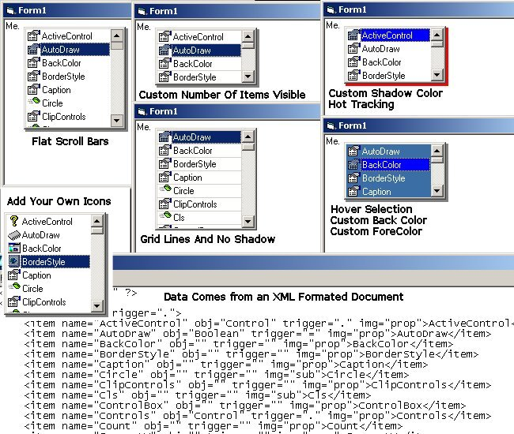



## Intellisense Completion \(Update 5\)

### Description

This is an Intellisense PopUp I'm working on for a project. It uses an XML data file to get the methods for the object, which allows this to be completly customizable for any language or what ever. Note that the example project is just that, an example, and in no way is it the 'perfect' way to popup the list. I am still working on this but wanted to post it so you could use and build off of it. Let me know what you think. I am also working on support for More then 1 level ( ex. Me.Controls.Blah) also if the select item is an object or can equal a boolean value it will load those methods as well. But I'm still working on that. I have included a sample methods file called defs.dat, which is the default filename for the control, but you can change it.

*** Update *** Now uses ListView to allow Images. Fixed a couple bugs too. Added Ability to use up and down arrows to select.

*** Another Update ***

Now supports Popups for other object (see screen shot)

*** Yes, Another Update ***

Mainly an update of the defs file. I added some more objects to it and changed a few things in it. Fixed a couple little bugs in the example program for gettitng the Intellisense to popup. Added support for different types of methods, three as of right now (Sub/Functions, Properties, Others like Boolean Values).

----

Why Look Another Update 

----

This time I've added an OnError Event that will allow you to capture any error that occurs. Flatscrollbars, Custom Visible Items, Custom ForeColor, Custome BackColor, GridLines, Remove or Show The shadow, Hover Selection, HotTracking. See the Screen shot for examples.

----

Heres another Update for you 

----

This time around I added the ability to a Use your own Images with out adding them to the image list within the control. You can use an external Image list or even Load the pictures from a file. And Just set up the defs.dat file in the "img" attribute to have the 'key' that you supply to add the image and Viola (see screenshot and demo app for example). Also added a few other properties like: ListIconCount (returns total images), ListIcon (returns the image)Add And Remove Items from the list, Add and Remove Images.

Thanks to all of you for the votes.

Watch for more updates.
 
### More Info
 

             |
---                |---
**Submitted On**   |2002-09-09 15:03:10
**By**             |[whiteknight](https://github.com/Planet-Source-Code/PSCIndex/blob/master/ByAuthor/whiteknight.md)
**Level**          |Intermediate
**User Rating**    |4.8 (173 globes from 36 users)
**Compatibility**  |VB 6\.0
**Category**       |[Custom Controls/ Forms/  Menus](https://github.com/Planet-Source-Code/PSCIndex/blob/master/ByCategory/custom-controls-forms-menus__1-4.md)
**World**          |[Visual Basic](https://github.com/Planet-Source-Code/PSCIndex/blob/master/ByWorld/visual-basic.md)
**Archive File**   |[Intellisen128890992002\.zip](https://github.com/Planet-Source-Code/whiteknight-intellisense-completion-update-5__1-38767/archive/master.zip)

